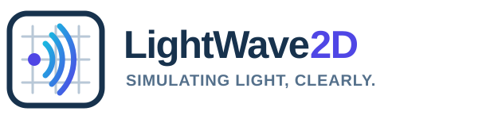

LightWave2D
===========

.. list-table::
   :widths: 35 65
   :header-rows: 1

   * - Badge
     - Status
   * - Python versions
     - |python|
   * - Documentation
     - |docs|
   * - Continuous integration
     - |ci/cd|
   * - Test coverage
     - |coverage|
   * - PyPI package
     - |PyPI|
   * - PyPI downloads
     - |PyPI_download|
   * - Anaconda package
     - |anaconda|
   * - Anaconda downloads
     - |anaconda_download|

LightWave2D is a software designed for comprehensive 2D Finite-Difference Time-Domain (FDTD) simulations, featuring a user-friendly installation and operation process. The characterization of wave propagation, scattering, and diffraction within LightWave2D is determined by a set of specific components, as illustrated in the subsequent figure.

LightWave2D integrates various components, including waveguides, scatterers  (squares, circles, ellipses, triangles, lenses), gratings, and resonators. Additional parameters governing the simulation are contingent upon the attributes of the components and the simulation setup.

Key Features
************

- Intuitive API for configuring simulations.
- Support for waveguides, scatterers, gratings, and resonators.
- Built-in tools for rendering field animations.
- Extensive gallery of examples in the documentation.

----

Documentation
**************
All the latest available documentation is available `here <https://martinpdes.github.io/LightWave2D/>`_ or you can click the following badge:

|docs|

----

Installation
************

Install the published package with pip:

.. code-block:: python

   >>> pip install LightWave2D

Building Documentation Locally
******************************

To generate the HTML documentation on your machine, install the optional dependencies and run:

.. code-block:: bash

   pip install .[documentation]
   cd docs && make html
   firefox build/html/index.html

Coding examples
***************

LightWave2D was developed with the aim of being an intuitive and easy to use tool.
All dimensional arguments can now be provided using `pint` quantities or strings with units.
Below are two examples that illustrate this:

Spherical scatterer
-------------------

.. code:: python

    from LightWave2D.grid import Grid
    from LightWave2D.experiment import Experiment
    from MPSPlots import colormaps
    from TypedUnit import ureg

    grid = Grid(
        resolution=0.1 * ureg.micrometer,
        size_x=32 * ureg.micrometer,
        size_y=20 * ureg.micrometer,
        n_steps=300
    )

   experiment = Experiment(grid=grid)

    scatterer = experiment.add_circle(
        position=('30%', '50%'),
        epsilon_r=2,
        radius=3 * ureg.micrometer
    )

    source = experiment.add_line_source(
        wavelength=1550 * ureg.nanometer,
        position_0=('10%', '100%'),
        position_1=('10%', '0%'),
        amplitude=10,
    )

   experiment.add_pml(order=1, width="10%", sigma_max=5000 * ureg.siemens / ureg.meter)

   experiment.run()

   animation = experiment.render_propagation(
       skip_frame=5,
       colormap=colormaps.polytechnique.red_black_blue
   )

   animation.save('./spherical_scatterer.gif', writer='Pillow', fps=10)

|example_scatterer|

Ring resonator
--------------

.. code:: python

   from LightWave2D.grid import Grid
   from LightWave2D.experiment import Experiment
   from MPSPlots.colormaps import polytechnique
   from TypedUnit import ureg

    grid = Grid(
        resolution=0.1 * ureg.micrometer,
        size_x=50 * ureg.micrometer,
        size_y=30 * ureg.micrometer,
        n_steps=800
    )

   experiment = Experiment(grid=grid)

    scatterer = experiment.add_ring_resonator(
        position=('35%', '50%'),
        epsilon_r=1.5,
        inner_radius=4 * ureg.micrometer,
        width=2 * ureg.micrometer
    )

    source = experiment.add_point_source(
        wavelength=1550 * ureg.nanometer,
        position=('25%', '50%'),
        amplitude=100,
    )

   experiment.add_pml(order=1, width="10%", sigma_max=5000 * ureg.siemens / ureg.meter)

   experiment.run()

   animation = experiment.render_propagation(skip_frame=5, colormap=polytechnique.red_black_blue)

   animation.save('./resonator.gif', writer='Pillow', fps=10)

|example_resonator|

Lens
----

.. code:: python

   from LightWave2D.grid import Grid
   from LightWave2D.experiment import Experiment
   from MPSPlots import colormaps
   from TypedUnit import ureg

    grid = Grid(
        resolution=0.1 * ureg.micrometer,
        size_x=60 * ureg.micrometer,
        size_y=30 * ureg.micrometer,
        n_steps=1200
    )

   experiment = Experiment(grid=grid)

    scatterer = experiment.add_lens(
        position=('35%', '50%'),
        epsilon_r=2,
        curvature=10 * ureg.micrometer,
        width=5 * ureg.micrometer
    )

    source = experiment.add_point_source(
        wavelength=1550 * ureg.nanometer,
        position=('10%', '50%'),
        amplitude=10,
    )

   experiment.add_pml(order=1, width="10%", sigma_max=5000 * ureg.siemens / ureg.meter)

   experiment.run()

   experiment.plot_frame(
       frame_number=-1,
       enhance_contrast=5,
       colormap=colormaps.polytechnique.red_black_blue
   )

   animation = experiment.render_propagation(
       skip_frame=5,
       colormap=colormaps.polytechnique.red_black_blue
   )

   animation.save('./lens.gif', writer='Pillow', fps=10)

|example_lens|

Plenty of other examples are available online; see the `examples <https://martinpdes.github.io/LightWave2D/gallery.html>`_
section of the documentation.

Testing
*******

To test locally (with cloning the GitHub repository) you'll need to install the dependencies and run the coverage command as

.. code:: python

   >>> git clone https://github.com/MartinPdeS/LightWave2D.git
   >>> cd LightWave2D
   >>> pip install -r requirements/requirements.txt
   >>> coverage run --source=LightWave2D --module pytest --verbose tests
   >>> coverage report --show-missing

Contributing
************

Contributions are welcome! Feel free to open an issue or submit a pull request on GitHub.

----

Contact Information
*******************

As of 2024 the project is still under development if you want to collaborate it would be a pleasure. I encourage you to contact me.

LightWave2D was written by `Martin Poinsinet de Sivry-Houle <https://github.com/MartinPdS>`_  .

Email:`martin.poinsinet-de-sivry@polymtl.ca <mailto:martin.poinsinet-de-sivry@polymtl.ca?subject=LightWave2D>`_ .

.. |example_resonator| image:: https://github.com/MartinPdeS/LightWave2D/blob/master/docs/images/resonator.gif?raw=true
   :alt: some image
   :class: with-shadow float-left
   :width: 800px

.. |example_lens| image:: https://github.com/MartinPdeS/LightWave2D/blob/master/docs/images/lens.gif?raw=true
   :alt: some image
   :class: with-shadow float-left
   :width: 800px

.. |example_scatterer| image:: https://github.com/MartinPdeS/LightWave2D/blob/master/docs/images/spherical_scatterer.gif?raw=true
   :alt: some image
   :class: with-shadow float-left
   :width: 800px

.. |python| image:: https://img.shields.io/pypi/pyversions/lightwave2d.svg
   :alt: Python
   :target: https://www.python.org/

.. |docs| image:: https://github.com/martinpdes/LightWave2D/actions/workflows/deploy_documentation.yml/badge.svg
   :target: https://martinpdes.github.io/LightWave2D/
   :alt: Documentation Status

.. |coverage| image:: https://raw.githubusercontent.com/MartinPdeS/LightWave2D/python-coverage-comment-action-data/badge.svg
   :alt: Unittest coverage
   :target: https://htmlpreview.github.io/?https://github.com/MartinPdeS/LightWave2D/blob/python-coverage-comment-action-data/htmlcov/index.html

.. |PyPI| image:: https://badge.fury.io/py/LightWave2D.svg
   :alt: PyPI version
   :target: https://pypi.org/project/LightWave2D/

.. |PyPI_download| image:: https://api.pepy.tech/badge/LightWave2D/month
   :alt: PyPI downloads
   :target: https://pepy.tech/projects/lightwave2d

.. |ci/cd| image:: https://github.com/martinpdes/lightwave2d/actions/workflows/deploy_coverage.yml/badge.svg
    :alt: Unittest Status
    :target: https://martinpdes.github.io/LightWave2D/actions

.. |anaconda| image:: https://anaconda.org/martinpdes/lightwave2d/badges/version.svg
   :alt: Anaconda version
   :target: https://anaconda.org/martinpdes/lightwave2d

.. |anaconda_download| image:: https://anaconda.org/martinpdes/lightwave2d/badges/downloads.svg
   :alt: Anaconda downloads
   :target: https://anaconda.org/martinpdes/lightwave2d
